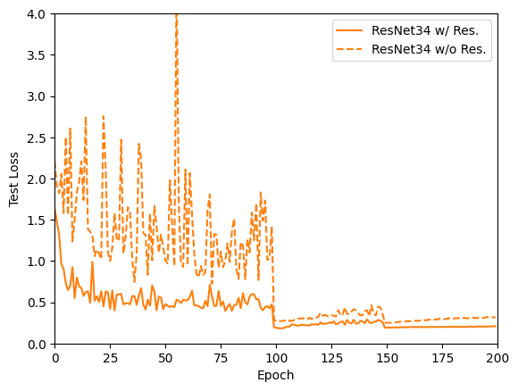

# Image Classification Using Convolutional Neural Networks

## Environment

* Python 3.11.5
* torch 2.2.0
* torchvision 0.17.2
* numpy 1.23.5


## Main Architectures


**Figure 1**: Network architectures for CIFAR10. From Left to Right: VGG16, VGG19, ResNet18, ResNet34 and ResNet50.


**Figure 4**: A illustration of residual function F in ResNet. Left: Basic block, Right: Bottleneck block.
## Feature Maps


**Figure 2**: The feature maps are obtained from our experiment con- ducted in CIFAR-10@ResNet18. The images show the feature maps at different network depths

## Network Performance


**Figure 3**: Networks performance comparison among different depths and architectures on CIFAR10.

## Main Result


**Figure 5**: Test error across epoch for the five models: VGG16, VGG19, ResNet18, ResNet34, and ResNet50 on CIFAR10.


| Model    | # Params | Test Acc. (%) | Throughput (img/s) |
|----------|----------|---------------|---------------------|
| ResNet18 | 11M      | 95.15         | 45,329             |
| ResNet34 | 21M      | 95.28         | 22,542             |
| ResNet50 | 24M      | 95.03         | 8,796              |
| VGG16    | 15M      | 93.83         | 65,161             |
| VGG19    | 20M      | 93.69         | 56,255             |

**Table 1**: Test Accuracy for Five CNN Models on CIFAR10. The **ResNet** architecture performs better in terms of accuracy compared to **VGG**, but it has lower throughput (tp.), making it less efficient. (tp. experiment on NVIDIA 4090 with a batch size of 128)

## Ablation Study: Residual Analysis

<div style="display: flex; justify-content: space-between;">

<div style="text-align: center;">
    
    <p>A): ResNet18.</p>
</div>

<div style="text-align: center;">
    
    <p>B): ResNet34.</p>
</div>

<div style="text-align: center;">
    
    <p>C): ResNet50.</p>
</div>

</div>

**Figure 6**: Performance comparison of ResNet architectures with and without residual connection: (a) ResNet18, (b) ResNet34, (c)
ResNet50. on CIFAR10


**Figure 7**: Standard deviations of the last layer response in each residual block on CIFAR10. The responses are the outputs of each 3×3 layer, after BN and before nonlinearity. 

## Parameter Tuning


<div style="display: flex; justify-content: space-between;">

<div style="text-align: center;">
    
    <p>A): Learning Rate.</p>
</div>

<div style="text-align: center;">
    
    <p>B): Weight Decay.</p>
</div>

</div>

**Figure 8**: Parameter Tuning: validation loss across epochs with respect to (a) learning rate scheduler, (b) weight decay, on CI- FAR10 using ResNet18.

| Augmentation                        | Val Acc. (%) |
|-------------------------------------|--------------|
| None                                | 87.13        |
| RandomCrop                          | 92.89        |
| &emsp;w/. + RandomHorizontalFlip    | 94.61        |
| RandomHorizontalFlip                | 90.66        |
| &emsp;w/. + RandomCrop              | 94.23        |

**Table 2**: Validation Accuracy across various augmentation methods on CIFAR10@ResNet18.

| Momentum              | Val Acc. (%) |
|-----------------------|--------------|
| w/. (β = 0.9)        | 94.61        |
| w/o. (β = 0)         | 93.23        |

**Table 3**: The influence of momentum on the Validation Accuracy on CIFAR10@ResNet18.

## Setup

### Training main result

* To train a ResNet18/ResNet34/ResNet50/VGG16/VGG19 with RPF on CIFAR-10:
```
python train.py --network "ResNet18" --residual --save_dir "best_result" 
python train.py --network "ResNet34" --residual --save_dir "best_result" 
python train.py --network "ResNet50" --residual --save_dir "best_result" 
python train.py --network "VGG16" --save_dir "best_result" 
python train.py --network "VGG19" --save_dir "best_result" 
```

### Parameter Tuning

* 1.LearningRate and Scheduler
```
python train.py --network "ResNet18" --residual --validation --save_dir "multistep"
python train.py --network "ResNet18" --residual --validation --lr_schedule "constant" --lr_max 1e-1 --save_dir "lr_1e1" 
python train.py --network "ResNet18" --residual --validation --lr_schedule "constant" --lr_max 1e-2 --save_dir "lr_1e2"
python train.py --network "ResNet18" --residual --validation --lr_schedule "constant" --lr_max 1e-3 --save_dir "lr_1e3"
python train.py --network "ResNet18" --residual --validation --lr_schedule "constant" --lr_max 1e-4 --save_dir "lr_1e4"
python train.py --network "ResNet18" --residual --validation --lr_schedule "constant" --lr_max 1e-5 --save_dir "lr_1e5"
```

* 2.Weight Decay
```
python train.py --network "ResNet18" --residual --validation --weight_decay "1e-2" --save_dir "weight_decay_1e2" 
python train.py --network "ResNet18" --residual --validation --weight_decay "5e-3" --save_dir "weight_decay_5e3"
python train.py --network "ResNet18" --residual --validation --weight_decay "1e-3" --save_dir "weight_decay_1e3"
python train.py --network "ResNet18" --residual --validation --weight_decay "5e-4" --save_dir "weight_decay_5e4"
python train.py --network "ResNet18" --residual --validation --weight_decay "1e-4" --save_dir "weight_decay_1e4"
python train.py --network "ResNet18" --residual --validation --weight_decay "0" --save_dir "weight_decay_0"
```

* 3.Momentum
```
python train.py --network "ResNet18" --residual --validation --device "2"  --save_dir "momentum_on"
python train.py --network "ResNet18" --residual --validation --momentum "0" --device "2"  --save_dir "momentum_off"
```

* 4.Residual
```
python train.py --network "ResNet18" --validation --save_dir "residual_off"
python train.py --network "ResNet18" --residual --validation --save_dir "residual_off"
```

* 5.augmentation
```
python train.py --network "ResNet18" --residual --validation --augs "RandomCrop" --save_dir "RandomCrop"
python train.py --network "ResNet18" --residual --validation --augs "RandomHorizontalFlip" --save_dir "RandomHorizontalFlip"
python train.py --network "ResNet18" --residual --validation --augs "RandomHorizontalFlip,RandomCrop" --save_dir "RandomHorizontalFlip_RandomCrop"
python train.py --network "ResNet18" --residual --validation --augs "RandomCrop,RandomHorizontalFlip" --save_dir "RandomCrop_RandomHorizontalFlip"
python train.py --network "ResNet18" --residual --validation --augs "" --save_dir "No_Aug"
```

### Study of Residual Network

* To evaluate the influence of residual connection:

```
python train.py --network "ResNet18" --residual --save_dir "test_residual_on"
python train.py --network "ResNet18" --save_dir "test_residual_off"

python train.py --network "ResNet34" --residual --save_dir "test_residual_on"
python train.py --network "ResNet34" --save_dir "test_residual_off"

python train.py --network "ResNet50" --residual --save_dir "test_residual_on"
python train.py --network "ResNet50" --save_dir "test_residual_off"
```


### Pretrained Models
Pretrained models are provided in [To be released].